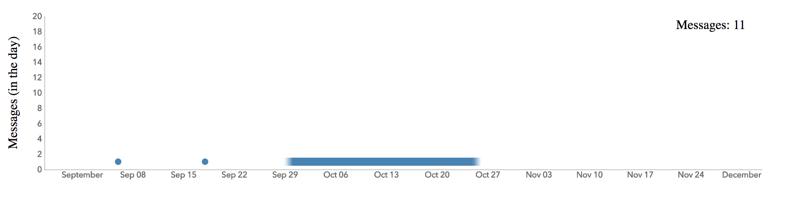

#UVIS.JS
A simple temporal and spatial uncertainty visualisation library built ontop of d3.js.

for uvis.barchat Get something that looks like


for a dataset that looks like

```js
var testData = [
        {name: 'Harry', value: 2, uncert: 10},
        {name: 'Mark', value: 5, uncert: 0},
        {name: 'James', value: 6, uncert: 4},
        {name: 'Dave', value: 3, uncert: 9},
        {name: 'Cahill', value: 7, uncert: 30},
        {name: 'Jordan', value: 5, uncert: 2},
        {name: 'Kane', value: 10, uncert: 20},
        {name: 'Marcus', value: 3, uncert: 7}
    ];
```

with a call that looks like

```js
var chart = uvis.barChart().width(500).utype('gradient');

var svg = d3.select("#timeline1")
  .datum(testData).call(chart);
```

Works with boxplot for uncertainty visualisation incase the gradient are too low.


```js
var chart = uvis.barChart().width(500).utype('boxplot');

var svg = d3.select("#timeline1")
  .datum(testData).call(chart);
```


for uvis.timelineChart Get something that looks like



for a dataset that looks like

```js
let dateData = [
        {message_id: 1970268.0, sent_time: '2013-04-05', end_time: '2013-04-10', messages_sent_in_day: 1},
        {message_id: 2298946.0, sent_time: '2013-05-29', messages_sent_in_day: 1},
        {message_id: 2575515.0, sent_time: '2013-07-13', messages_sent_in_day: 1},
        {message_id: 2610242.0, sent_time: '2013-07-17', messages_sent_in_day: 1},
        {message_id: 2610242.0, sent_time: '2013-07-18', end_time: '2013-07-19', messages_sent_in_day: 1},
        {message_id: 2610242.0, sent_time: '2013-07-20', messages_sent_in_day: 1},
        {message_id: 2610242.0, sent_time: '2013-07-21', messages_sent_in_day: 1},
        {message_id: 2926234.0, sent_time: '2013-08-21', messages_sent_in_day: 1},
        {message_id: 3110458.0, sent_time: '2013-09-06', messages_sent_in_day: 1},
        {message_id: 3130002.0, sent_time: '2013-09-18', messages_sent_in_day: 1},
        {message_id: 3255637.0, sent_time: '2013-09-29', end_time: '2013-10-25', messages_sent_in_day: 1},
    ];
```

with a call that looks like

```js
var chart = uvis.timelineChart().uncertainty(10);

var svg = d3.select("#timeline1")
  .datum(testData).call(chart);
```
